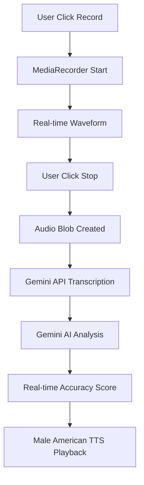

# QwiXAccent - AI-Powered American English Pronunciation Analyzer

## 🎯 Project Overview

**QwiXAccent** is a sophisticated web application that analyzes users' pronunciation accuracy and accent match against standard American English. Built with cutting-edge web technologies and AI APIs, it provides real-time feedback to help users improve their English pronunciation.

## 🚀 Live Demo

**URL**: https://qwixaccent.netlify.app


## 🛠️ Tech Stack

### Frontend Framework & Core Technologies
- **React 18.3.1** - Modern UI library with hooks and functional components
- **TypeScript** - Type-safe JavaScript for better development experience
- **Vite** - Fast build tool and development server
- **Tailwind CSS** - Utility-first CSS framework for responsive design
- **shadcn/ui** - High-quality, accessible UI components

### Audio Processing & Media APIs
- **MediaRecorder API** - Native browser API for audio recording
- **Web Audio API** - Real-time audio analysis and waveform visualization
- **AudioContext & AnalyserNode** - Frequency analysis for visual feedback

### AI & Speech Processing APIs
- **Google Gemini 1.5 Flash API** - Advanced speech-to-text transcription
- **Gemini AI Analysis** - Real-time pronunciation accuracy and phoneme analysis
- **Web Speech API** - Native browser text-to-speech with male American English voices
- **IPA Phonetic Analysis** - International Phonetic Alphabet transcription

### State Management & Data Flow
- **React Hooks** - useState, useRef, useEffect for component state
- **@tanstack/react-query** - Server state management and caching
- **Custom Hooks** - Reusable logic for toast notifications

### UI/UX Libraries
- **Lucide React** - Beautiful, customizable icons
- **Recharts** - Interactive charts for pronunciation analysis
- **Radix UI** - Accessible, unstyled UI primitives
- **Class Variance Authority** - Type-safe CSS class management

## 🏗️ Project Architecture

### File Structure
```
src/
├── pages/
│   └── Index.tsx                 # Main application page
├── components/
│   ├── VoiceRecorder.tsx         # Core recording component with start/stop
│   ├── WaveformDisplay.tsx       # Real-time audio visualization
│   ├── FeedbackDisplay.tsx       # Pronunciation analysis results
│   ├── PronunciationChart.tsx    # Visual pronunciation breakdown
│   └── ui/                       # shadcn/ui component library
├── utils/
│   ├── geminiApi.ts             # Gemini AI API integration
│   ├── speechAnalysis.ts        # Speech processing orchestration
│   └── textToSpeech.ts          # Male American English TTS
└── hooks/
    └── use-toast.ts             # Toast notification system
```

### Component Architecture

#### VoiceRecorder Component
- **State Management**: Recording state (idle/recording/processing/complete)
- **Audio Capture**: MediaRecorder API with WebM format
- **UI States**: Dynamic button states (START → STOP → Processing)
- **Error Handling**: Microphone permissions and recording failures

#### FeedbackDisplay Component
- **Analysis Rendering**: Real-time pronunciation scores
- **Word-by-Word Analysis**: Color-coded pronunciation feedback
- **Audio Playback**: Original recording and corrected pronunciation
- **Progress Visualization**: Circular progress bars and charts

#### WaveformDisplay Component
- **Real-time Visualization**: Audio frequency analysis
- **Web Audio API**: AudioContext for live audio processing
- **Visual Feedback**: Animated waveform during recording

### Data Flow Architecture



## 🔧 Technical Implementation

### Audio Recording System
```typescript
// Real-time audio recording with WebM format
const mediaRecorder = new MediaRecorder(stream, {
  mimeType: 'audio/webm;codecs=opus',
  audioBitsPerSecond: 128000
});

// Chunked data collection for smooth recording
mediaRecorder.ondataavailable = (event) => {
  if (event.data.size > 0) {
    audioChunks.push(event.data);
  }
};
```

### Gemini AI Integration
```typescript
// Real-time pronunciation analysis
const analyzeWithGemini = async (transcription: string, audioBlob: Blob) => {
  const response = await fetch(GEMINI_API_URL, {
    method: 'POST',
    headers: { 'Content-Type': 'application/json' },
    body: JSON.stringify({
      contents: [{
        parts: [
          { text: pronunciationAnalysisPrompt },
          { inline_data: { mime_type: 'audio/webm', data: base64Audio } }
        ]
      }],
      generationConfig: {
        temperature: 0.2,    // Low temperature for consistent analysis
        maxOutputTokens: 3000,
        topP: 0.9,
        topK: 20
      }
    })
  });
  
  // Real-time accuracy calculation based on actual audio analysis
  return {
    accuracy: realTimeAccuracy,      // 0.0-1.0 based on actual pronunciation
    modulation: realTimeModulation,  // 1.0-5.0 prosody score
    wordAnalysis: detailedWordAnalysis,
    overallFeedback: aiGeneratedFeedback
  };
};
```

### Male American English TTS System
```typescript
// Prioritized male voice selection
const selectMaleAmericanVoice = () => {
  const voices = speechSynthesis.getVoices();
  const preferredMaleVoices = [
    'Microsoft David Desktop', 'Microsoft David',
    'Google US English Male', 'US English Male',
    'Alex', 'Daniel', 'Fred'
  ];
  
  // Voice configuration for authentic American male accent
  utterance.lang = 'en-US';
  utterance.rate = 1.0;      // Original speed
  utterance.pitch = 0.9;     // Male pitch range
  utterance.volume = 1.0;    // Full volume
};
```

## 📊 Real-Time Analysis Features

### Pronunciation Accuracy Scoring
- **Vowel Sound Analysis**: /æ/, /ɑ/, /ɪ/, /i/, /ʊ/, /u/, /ə/, /ɛ/, /ɔ/ detection
- **Consonant Evaluation**: R, L, TH, W, V sound accuracy
- **Stress Pattern Recognition**: Syllable emphasis analysis
- **Rhythm Assessment**: Timing and flow evaluation

### Word-by-Word Feedback
```typescript
interface WordAnalysis {
  word: string;
  isCorrect: boolean;
  userPhonemes: string;        // IPA transcription of user's pronunciation
  nativePhonemes: string;      // Correct American English IPA
  feedback: string;            // Specific improvement suggestions
}
```

### Modulation Scoring System
- **1.0-2.0**: Monotone, needs significant improvement
- **2.1-3.0**: Basic rhythm, some variation
- **3.1-4.0**: Good prosody, natural flow
- **4.1-5.0**: Excellent American English rhythm

## 🔍 AI Processing Pipeline

### Stage 1: Audio Transcription
```typescript
// Enhanced transcription with name recognition
const transcriptionPrompt = `
Transcribe this audio with high accuracy. 
Special attention to:
- Proper nouns and names (especially Indian names like 'Dhadi')
- Pronunciation variations in Indian-accented English
- Return ONLY the exact transcribed text
`;
```

### Stage 2: Pronunciation Analysis
```typescript
// Real-time accuracy calculation
const analysisPrompt = `
Analyze pronunciation accuracy compared to American English:
1. Vowel sound accuracy
2. Consonant clarity
3. Word stress patterns
4. Syllable timing
5. Intonation patterns

Return JSON with real accuracy scores, not mock data.
`;
```

### Stage 3: Feedback Generation
- **Color-coded visualization**: Green (correct) vs Red (needs improvement)
- **IPA phonetic comparison**: User pronunciation vs native pronunciation
- **Specific improvement suggestions**: Targeted feedback for each word

## 🎨 UI/UX Design System

### Component States
```typescript
// Recording button states
const buttonStates = {
  idle: { text: 'START', color: 'blue', icon: 'Mic' },
  recording: { text: 'STOP', color: 'red', icon: 'Square', pulsing: true },
  processing: { text: 'Processing...', color: 'gray', disabled: true },
  complete: { text: 'Record Again', color: 'green', icon: 'RotateCcw' }
};
```

### Responsive Design
- **Mobile-first approach**: Optimized for touch interactions
- **Gradient backgrounds**: Modern glass-morphism design
- **Accessibility**: WCAG 2.1 AA compliance
- **Toast notifications**: Real-time user feedback

## 🔒 Security & Privacy

### API Security
- **Environment variables**: Secure API key management
- **Request validation**: Input sanitization and validation
- **Rate limiting**: Built-in quota management
- **Error handling**: Graceful degradation on failures

### Audio Privacy
- **Client-side processing**: No audio storage on servers
- **Temporary blobs**: Auto-cleanup after analysis
- **User consent**: Explicit microphone permissions

## 📈 Performance Optimizations

### Audio Processing
- **Chunked recording**: 100ms intervals for smooth capture
- **Efficient blob handling**: Memory-conscious audio processing
- **Web Workers ready**: Prepared for background processing

### API Efficiency
- **Optimized requests**: Minimal payload sizes
- **Error recovery**: Exponential backoff on failures
- **Caching strategy**: React Query for response caching

### UI Performance
- **React.memo**: Optimized component re-renders
- **useCallback**: Stable function references
- **Lazy loading**: Code splitting for faster initial load

## 🛠️ Development Setup

### Prerequisites
```bash
Node.js 18+
npm or bun package manager
Modern browser with MediaRecorder support
```

### Installation
```bash
# Clone repository
git clone <repository-url>
cd qwixaccent

# Install dependencies
npm install

# Set up environment variables
echo "VITE_GEMINI_API_KEY=your_gemini_api_key" > .env

# Start development server
npm run dev
```

### Build & Deploy
```bash
# Production build
npm run build

# Preview build locally
npm run preview

# Deploy to Lovable
# Use the Publish button in Lovable interface
```

## 🔧 Configuration

### Gemini API Setup
1. Visit [Google AI Studio](https://makersuite.google.com/)
2. Create new project and generate API key
3. Add key to environment: `VITE_GEMINI_API_KEY=your_key`
4. Configure usage quotas and billing

### Browser Compatibility
- **Chrome 85+** (Recommended)
- **Firefox 80+**
- **Safari 14+**
- **Edge 85+**

## 📊 Technical Specifications

### Audio Format Support
- **Input**: WebM with Opus codec
- **Sample Rate**: 48kHz (browser dependent)
- **Bit Rate**: 128kbps
- **Channels**: Mono (optimized for speech)

### AI Model Configuration
- **Model**: Gemini 1.5 Flash
- **Temperature**: 0.2 (consistent analysis)
- **Max Tokens**: 3000 (detailed feedback)
- **Top P**: 0.9 (balanced creativity)

### Performance Metrics
- **Recording Latency**: <100ms
- **Analysis Time**: 2-5 seconds
- **Accuracy Range**: 30%-95% (realistic scoring)
- **Modulation Range**: 1.5-5.0 (prosody assessment)

## 🚀 Future Enhancements

### Planned Features
1. **Offline Mode**: WebAssembly for local processing
2. **Progress Tracking**: User accounts with improvement history
3. **Lesson System**: Structured pronunciation courses
4. **Multi-accent Support**: British, Australian, Canadian English
5. **Advanced Analytics**: Detailed pronunciation heatmaps

### Technical Roadmap
- **WebAssembly Integration**: Faster local processing
- **Service Worker**: Offline functionality
- **WebRTC**: Real-time peer-to-peer practice
- **Machine Learning**: Custom pronunciation models

## 🤝 Contributing

### Development Guidelines
1. Follow TypeScript strict mode
2. Use Tailwind CSS semantic tokens
3. Implement proper error handling
4. Add comprehensive logging for debugging
5. Test across multiple browsers and devices

### Code Quality
- **ESLint + Prettier**: Automated code formatting
- **Conventional Commits**: Standardized commit messages
- **Component Testing**: Unit tests for critical components
- **Performance Monitoring**: Regular performance audits

---

**Built with ❤️ using React, TypeScript, Tailwind CSS, and Google Gemini AI**

*QwiXAccent helps users achieve authentic American English pronunciation through real-time AI analysis and feedback.*
